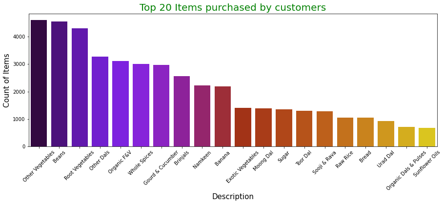

## Market Basket Analysis

### Association Rule Mining

`Association rule learning` is a rule-based machine learning method for discovering interesting relations between variables in large databases. It is intended to identify strong rules discovered in databases using some measures of interestingness.

First of all, we need to know some terms about Association Rules.

- **Support: Support is an indication of how frequently the itemset appears in the dataset.**

Support is a so-called frequency constraint. Its main feature is that it possesses the property of down-ward closure which means that all sub sets of a frequent set (support > min. support threshold) are also frequent. This property (actually, the fact that no super set of a infrequent set can be frequent) is used to prune the search space (usually a tree of item sets with increasing size) in level-wise algorithms (e.g., the APRIORI algorithm). The disadvantage of support is the rare item problem. Items that occur very infrequently in the data set are pruned although they would still produce interesting and potentially valuable rules.

- **Confidence: Confidence is an indication of how often the rule has been found to be true.**

Confidence is not down-ward closed and was developed together with support (the so-called support-confidence framework). While support is used to prune the search space and only leave potentially interesting rules, confidence is used in a second step to filter rules that exceed a min. confidence threshold. A problem with confidence is that it is sensitive to the frequency of the consequent (Y) in the data set. Caused by the way confidence is calculated, Ys with higher support will automatically produce higher confidence values even if they exists no association between the items.

- **Lift: The ratio of the observed support to that expected if X and Y were independent.**

Leverage measures the difference of X and Y appearing together in the data set and what would be expected if X and Y where statistically dependent. The rational in a sales setting is to find out how many more units (items X and Y together) are sold than expected from the independent sells. Using min. leverage thresholds at the same time incorporates an implicit frequency constraint. E.g., for setting a min. leverage thresholds to 0.01% (corresponds to 10 occurrence in a data set with 100,000 transactions) one first can use an algorithm to find all itemsets with min. support of 0.01% and then filter the found item sets using the leverage constraint. Because of this property leverage also can suffer from the rare item problem.

- **Conviction:** The ratio of the expected frequency that X occurs without Y (that is to say, the frequency that the rule makes an incorrect prediction) if X and Y were independent divided by the observed frequency of incorrect predictions.

Conviction compares the probability that X appears without Y if they were dependent with the actual frequency of the appearance of X without Y. In that respect it is similar to lift (see section about lift on this page), however, it contrast to lift it is a directed measure. Furthermore, conviction is monotone in confidence and lift.

- **Leverage:** Leverage measures the difference of X and Y appearing together in the data set and what would be expected if X and Y where statistically dependent.

The rational in a sales setting is to find out how many more units (items X and Y together) are sold than expected from the independent sells. Using min. leverage thresholds at the same time incorporates an implicit frequency constraint. E.g., for setting a min. leverage thresholds to 0.01% (corresponds to 10 occurrence in a data set with 100,000 transactions) one first can use an algorithm to find all itemsets with min. support of 0.01% and then filter the found item sets using the leverage constraint. Because of this property leverage also can suffer from the rare item problem. [Michael Hahsler]

### Dataset


```python

```

### Importing libraries


```python
# Libraries
import pandas as pd, numpy as np, matplotlib.pyplot as plt, seaborn as sns
from apyori import apriori
```


```python
#dataset
df = pd.read_excel('/Users/mhlaghari/Documents/Documents/NYU/Module 2 \
/Data Mining in R/InClass/Case 1 - Recommendations/BigBasket Data IMB575-XLS-ENG (1).xlsx',sheet_name= 'POS DATA')
```


```python
plt.figure(figsize=(15,5))
sns.barplot(x = df.Description.value_counts().head(20).index, y = df.Description.value_counts().head(20).values, palette = 'gnuplot')
plt.xlabel('Description', size = 15)
plt.xticks(rotation=45)
plt.ylabel('Count of Items', size = 15)
plt.title('Top 20 Items purchased by customers', color = 'green', size = 20)
plt.show()
```


    

    


### Data Engineering


```python
#To see all columns
df.columns
```


    Index(['Member', 'Order', 'SKU', 'Created On', 'Description'], dtype='object')


```python
#Dropping unnecessary columns ['Member', 'SKU', 'Created On']
#Setting index to 'Order'
#Grouping by 'Order'

df2 = df.drop(['Member', 'SKU', 'Created On'],axis=1).set_index('Order')\
.groupby('Order')['Description'].apply(list).reset_index().drop('Order',axis=1)\
['Description'].apply(pd.Series)
```


```python
#Saving the cleaned dataset 
df2.to_csv('Market_Basket_Cleaned.csv', header= False, index= False)
```


```python
dataset = pd.read_csv('Market_Basket_Cleaned.csv'\
                      ,header= None)
transaction = []
for i in range(0,8387):
    transaction.append([str(dataset.values[i,j]) for j in range(0,42)])
```

### Apriori

Using the `apriori` algorithm, we set a few parameters.
- min_support = Caluclated by days of the week * the number of times a product appears together / the dataset
- min_confidence = should be between 0 - 1; varies on the business case
- min_lift = at least the number of times you wish to see the items together
- min/max_length = best deals for a buy 1 get 1 free offer


```python
# Assuming our dataset is for 1 week, our min_support = 0.0025 (3 * 7/ 8387); 
#where:
#3 = times the product must appear together
#7 = 7 days in a week

rules = apriori(transactions= transaction, min_support = 0.0025, \
                min_confidence = 0.2, min_lift = 2, min_length = 2, \
                max_length = 2)
```


```python
results = list(rules)
results
```


    [RelationRecord(items=frozenset({'Almonds', 'Cashews'}), support=0.02170025038750447, ordered_statistics=[OrderedStatistic(items_base=frozenset({'Almonds'}), items_add=frozenset({'Cashews'}), confidence=0.35, lift=5.63426103646833), OrderedStatistic(items_base=frozenset({'Cashews'}), items_add=frozenset({'Almonds'}), confidence=0.3493282149712092, lift=5.63426103646833)]),
     RelationRecord(items=frozenset({'Other Dry Fruits', 'Almonds'}), support=0.017169428878025517, ordered_statistics=[OrderedStatistic(items_base=frozenset({'Almonds'}), items_add=frozenset({'Other Dry Fruits'}), confidence=0.27692307692307694, lift=4.838653846153846), OrderedStatistic(items_base=frozenset({'Other Dry Fruits'}), items_add=frozenset({'Almonds'}), confidence=0.30000000000000004, lift=4.838653846153847)]),
     RelationRecord(items=frozenset({'Raisins', 'Almonds'}), support=0.012877071658519137, ordered_statistics=[OrderedStatistic(items_base=frozenset({'Almonds'}), items_add=frozenset({'Raisins'}), confidence=0.2076923076923077, lift=4.657527766351296), OrderedStatistic(items_base=frozenset({'Raisins'}), items_add=frozenset({'Almonds'}), confidence=0.2887700534759358, lift=4.657527766351296)]),
     RelationRecord(items=frozenset({'Avalakki / Poha', 'Besan'}), support=0.012280910933587696, ordered_statistics=[OrderedStatistic(items_base=frozenset({'Besan'}), items_add=frozenset({'Avalakki / Poha'}), confidence=0.21413721413721415, lift=2.78013748447185)]),
     RelationRecord(items=frozenset({'Jaggery', 'Avalakki / Poha'}), support=0.006915464409204722, ordered_statistics=[OrderedStatistic(items_base=frozenset({'Jaggery'}), items_add=frozenset({'Avalakki / Poha'}), confidence=0.20138888888888887, lift=2.614626332989336)]),
     RelationRecord(items=frozenset({'Other Flours', 'Avalakki / Poha'}), support=0.00560391081435555, ordered_statistics=[OrderedStatistic(items_base=frozenset({'Other Flours'}), items_add=frozenset({'Avalakki / Poha'}), confidence=0.31333333333333335, lift=4.067997936016512)]),
     RelationRecord(items=frozenset({'Avalakki / Poha', 'Raw Peanuts'}), support=0.012638607368546561, ordered_statistics=[OrderedStatistic(items_base=frozenset({'Raw Peanuts'}), items_add=frozenset({'Avalakki / Poha'}), confidence=0.21544715447154472, lift=2.7971444033325783)]),
     RelationRecord(items=frozenset({'Avalakki / Poha', 'Rice Flour'}), support=0.006438535829259569, ordered_statistics=[OrderedStatistic(items_base=frozenset({'Rice Flour'}), items_add=frozenset({'Avalakki / Poha'}), confidence=0.27835051546391754, lift=3.613816986371326)]),
     RelationRecord(items=frozenset({'Avalakki / Poha', 'Sooji & Rava'}), support=0.026588768331942292, ordered_statistics=[OrderedStatistic(items_base=frozenset({'Avalakki / Poha'}), items_add=frozenset({'Sooji & Rava'}), confidence=0.3452012383900929, lift=2.610642728924896), OrderedStatistic(items_base=frozenset({'Sooji & Rava'}), items_add=frozenset({'Avalakki / Poha'}), confidence=0.20108205590622183, lift=2.610642728924896)]),
     RelationRecord(items=frozenset({'Avalakki / Poha', 'Toor Dal'}), support=0.025515679027065696, ordered_statistics=[OrderedStatistic(items_base=frozenset({'Avalakki / Poha'}), items_add=frozenset({'Toor Dal'}), confidence=0.33126934984520123, lift=2.175689927291858)]),
     RelationRecord(items=frozenset({'Urad Dal', 'Avalakki / Poha'}), support=0.019434839632764992, ordered_statistics=[OrderedStatistic(items_base=frozenset({'Avalakki / Poha'}), items_add=frozenset({'Urad Dal'}), confidence=0.25232198142414863, lift=2.457868127995743)]),
     RelationRecord(items=frozenset({'Vermicelli', 'Avalakki / Poha'}), support=0.0026231071896983425, ordered_statistics=[OrderedStatistic(items_base=frozenset({'Vermicelli'}), items_add=frozenset({'Avalakki / Poha'}), confidence=0.21999999999999997, lift=2.85625386996904)]),
     RelationRecord(items=frozenset({'Instant Pastas', 'Banana'}), support=0.005246214379396685, ordered_statistics=[OrderedStatistic(items_base=frozenset({'Instant Pastas'}), items_add=frozenset({'Banana'}), confidence=0.5301204819277109, lift=2.036702007296249)]),
     RelationRecord(items=frozenset({'Maida', 'Besan'}), support=0.010969357338738524, ordered_statistics=[OrderedStatistic(items_base=frozenset({'Maida'}), items_add=frozenset({'Besan'}), confidence=0.2100456621004566, lift=3.662480183028128)]),
     RelationRecord(items=frozenset({'Moong Dal', 'Besan'}), support=0.01669250029808036, ordered_statistics=[OrderedStatistic(items_base=frozenset({'Besan'}), items_add=frozenset({'Moong Dal'}), confidence=0.291060291060291, lift=2.158375474025341)]),
     RelationRecord(items=frozenset({'Other Dals', 'Besan'}), support=0.027900321926791462, ordered_statistics=[OrderedStatistic(items_base=frozenset({'Besan'}), items_add=frozenset({'Other Dals'}), confidence=0.48648648648648646, lift=2.0902470093043863)]),
     RelationRecord(items=frozenset({'Rice Flour', 'Besan'}), support=0.005723142959341838, ordered_statistics=[OrderedStatistic(items_base=frozenset({'Rice Flour'}), items_add=frozenset({'Besan'}), confidence=0.24742268041237112, lift=4.314207943073922)]),
     RelationRecord(items=frozenset({'Sooji & Rava', 'Besan'}), support=0.019911768212710148, ordered_statistics=[OrderedStatistic(items_base=frozenset({'Besan'}), items_add=frozenset({'Sooji & Rava'}), confidence=0.3471933471933472, lift=2.6257083885578028)]),
     RelationRecord(items=frozenset({'Toor Dal', 'Besan'}), support=0.01824251818290211, ordered_statistics=[OrderedStatistic(items_base=frozenset({'Besan'}), items_add=frozenset({'Toor Dal'}), confidence=0.31808731808731805, lift=2.0891138111185095)]),
     RelationRecord(items=frozenset({'Urad Dal', 'Besan'}), support=0.016096339573148922, ordered_statistics=[OrderedStatistic(items_base=frozenset({'Besan'}), items_add=frozenset({'Urad Dal'}), confidence=0.2806652806652807, lift=2.7339601729845633)]),
     RelationRecord(items=frozenset({'Whole Spices', 'Besan'}), support=0.024323357577202814, ordered_statistics=[OrderedStatistic(items_base=frozenset({'Besan'}), items_add=frozenset({'Whole Spices'}), confidence=0.4241164241164241, lift=2.0813718250815967)]),
     RelationRecord(items=frozenset({'Boiled Rice', 'Moong Dal'}), support=0.01824251818290211, ordered_statistics=[OrderedStatistic(items_base=frozenset({'Boiled Rice'}), items_add=frozenset({'Moong Dal'}), confidence=0.2925430210325048, lift=2.1693707492481145)]),
     RelationRecord(items=frozenset({'Boiled Rice', 'Other Rice Products'}), support=0.01764635745797067, ordered_statistics=[OrderedStatistic(items_base=frozenset({'Boiled Rice'}), items_add=frozenset({'Other Rice Products'}), confidence=0.28298279158699813, lift=3.995583624646723), OrderedStatistic(items_base=frozenset({'Other Rice Products'}), items_add=frozenset({'Boiled Rice'}), confidence=0.2491582491582492, lift=3.9955836246467227)]),
     RelationRecord(items=frozenset({'Boiled Rice', 'Sooji & Rava'}), support=0.017288661023011805, ordered_statistics=[OrderedStatistic(items_base=frozenset({'Boiled Rice'}), items_add=frozenset({'Sooji & Rava'}), confidence=0.2772466539196941, lift=2.096724694701961)]),
     RelationRecord(items=frozenset({'Boiled Rice', 'Toor Dal'}), support=0.019315607487778705, ordered_statistics=[OrderedStatistic(items_base=frozenset({'Boiled Rice'}), items_add=frozenset({'Toor Dal'}), confidence=0.30975143403441685, lift=2.034365917969189)]),
     RelationRecord(items=frozenset({'Boiled Rice', 'Urad Dal'}), support=0.020746393227614165, ordered_statistics=[OrderedStatistic(items_base=frozenset({'Boiled Rice'}), items_add=frozenset({'Urad Dal'}), confidence=0.33269598470363293, lift=3.240791200591602), OrderedStatistic(items_base=frozenset({'Urad Dal'}), items_add=frozenset({'Boiled Rice'}), confidence=0.20209059233449478, lift=3.2407912005916018)]),
     RelationRecord(items=frozenset({'Bread', 'Buns & Pavs'}), support=0.006080839394300703, ordered_statistics=[OrderedStatistic(items_base=frozenset({'Buns & Pavs'}), items_add=frozenset({'Bread'}), confidence=0.26153846153846155, lift=2.178275150867008)]),
     RelationRecord(items=frozenset({'Other Oils', 'Bread'}), support=0.004650053654465244, ordered_statistics=[OrderedStatistic(items_base=frozenset({'Other Oils'}), items_add=frozenset({'Bread'}), confidence=0.2653061224489796, lift=2.209654864925116)]),
     RelationRecord(items=frozenset({'Cakes', 'Namkeen'}), support=0.003934660784547514, ordered_statistics=[OrderedStatistic(items_base=frozenset({'Cakes'}), items_add=frozenset({'Namkeen'}), confidence=0.30275229357798167, lift=2.069424194163433)]),
     RelationRecord(items=frozenset({'Other Dry Fruits', 'Cashews'}), support=0.018004053892929535, ordered_statistics=[OrderedStatistic(items_base=frozenset({'Cashews'}), items_add=frozenset({'Other Dry Fruits'}), confidence=0.28982725527831094, lift=5.064127479206654), OrderedStatistic(items_base=frozenset({'Other Dry Fruits'}), items_add=frozenset({'Cashews'}), confidence=0.3145833333333334, lift=5.064127479206655)]),
     RelationRecord(items=frozenset({'Raisins', 'Cashews'}), support=0.018004053892929535, ordered_statistics=[OrderedStatistic(items_base=frozenset({'Cashews'}), items_add=frozenset({'Raisins'}), confidence=0.28982725527831094, lift=6.499414946575384), OrderedStatistic(items_base=frozenset({'Raisins'}), items_add=frozenset({'Cashews'}), confidence=0.4037433155080214, lift=6.499414946575385)]),
     RelationRecord(items=frozenset({'Sooji & Rava', 'Cashews'}), support=0.016811732443066652, ordered_statistics=[OrderedStatistic(items_base=frozenset({'Cashews'}), items_add=frozenset({'Sooji & Rava'}), confidence=0.2706333973128599, lift=2.046710823501313)]),
     RelationRecord(items=frozenset({'Toor Dal', 'Chinese Noodles'}), support=0.002742339334684631, ordered_statistics=[OrderedStatistic(items_base=frozenset({'Chinese Noodles'}), items_add=frozenset({'Toor Dal'}), confidence=0.3194444444444444, lift=2.0980270599495343)]),
     RelationRecord(items=frozenset({'Chips', 'Namkeen'}), support=0.012042446643615118, ordered_statistics=[OrderedStatistic(items_base=frozenset({'Chips'}), items_add=frozenset({'Namkeen'}), confidence=0.33554817275747506, lift=2.29359618982636)]),
     RelationRecord(items=frozenset({'Cookies', 'Namkeen'}), support=0.007630857279122451, ordered_statistics=[OrderedStatistic(items_base=frozenset({'Cookies'}), items_add=frozenset({'Namkeen'}), confidence=0.31683168316831684, lift=2.165662042976914)]),
     RelationRecord(items=frozenset({'Cooking Paste', 'Toor Dal'}), support=0.009300107308930487, ordered_statistics=[OrderedStatistic(items_base=frozenset({'Cooking Paste'}), items_add=frozenset({'Toor Dal'}), confidence=0.34061135371179035, lift=2.237045750650576)]),
     RelationRecord(items=frozenset({'Corn Snacks', 'Namkeen'}), support=0.0091808751639442, ordered_statistics=[OrderedStatistic(items_base=frozenset({'Corn Snacks'}), items_add=frozenset({'Namkeen'}), confidence=0.49358974358974367, lift=3.3738689319373925)]),
     RelationRecord(items=frozenset({'Cream Biscuits', 'Healthy & Digestive Biscuits'}), support=0.0029808036246572077, ordered_statistics=[OrderedStatistic(items_base=frozenset({'Healthy & Digestive Biscuits'}), items_add=frozenset({'Cream Biscuits'}), confidence=0.20161290322580644, lift=3.4579292829342303)]),
     RelationRecord(items=frozenset({'Cream Biscuits', 'Namkeen'}), support=0.017169428878025517, ordered_statistics=[OrderedStatistic(items_base=frozenset({'Cream Biscuits'}), items_add=frozenset({'Namkeen'}), confidence=0.294478527607362, lift=2.012869935650322)]),
     RelationRecord(items=frozenset({'Milk', 'Exotic Vegetables'}), support=0.002742339334684631, ordered_statistics=[OrderedStatistic(items_base=frozenset({'Milk'}), items_add=frozenset({'Exotic Vegetables'}), confidence=0.32857142857142857, lift=2.6964076041375455)]),
     RelationRecord(items=frozenset({'Sooji & Rava', 'Ghee'}), support=0.010015500178848218, ordered_statistics=[OrderedStatistic(items_base=frozenset({'Ghee'}), items_add=frozenset({'Sooji & Rava'}), confidence=0.298932384341637, lift=2.2607266974511355)]),
     RelationRecord(items=frozenset({'Toor Dal', 'Ghee'}), support=0.011684750208656254, ordered_statistics=[OrderedStatistic(items_base=frozenset({'Ghee'}), items_add=frozenset({'Toor Dal'}), confidence=0.34875444839857656, lift=2.2905274539693514)]),
     RelationRecord(items=frozenset({'Urad Dal', 'Ghee'}), support=0.007869321569095028, ordered_statistics=[OrderedStatistic(items_base=frozenset({'Ghee'}), items_add=frozenset({'Urad Dal'}), confidence=0.23487544483985764, lift=2.287921435391273)]),
     RelationRecord(items=frozenset({'Ground Coffee', 'Toor Dal'}), support=0.01049242875879337, ordered_statistics=[OrderedStatistic(items_base=frozenset({'Ground Coffee'}), items_add=frozenset({'Toor Dal'}), confidence=0.31095406360424027, lift=2.04226447255189)]),
     RelationRecord(items=frozenset({'Urad Dal', 'Ground Coffee'}), support=0.008107785859067605, ordered_statistics=[OrderedStatistic(items_base=frozenset({'Ground Coffee'}), items_add=frozenset({'Urad Dal'}), confidence=0.2402826855123675, lift=2.340593360502005)]),
     RelationRecord(items=frozenset({'Oats', 'Health Drinks'}), support=0.0025038750447120544, ordered_statistics=[OrderedStatistic(items_base=frozenset({'Oats'}), items_add=frozenset({'Health Drinks'}), confidence=0.2727272727272727, lift=4.897994938680163)]),
     RelationRecord(items=frozenset({'Organic Salt,Sugar & Jaggery', 'Health Drinks'}), support=0.00417312507452009, ordered_statistics=[OrderedStatistic(items_base=frozenset({'Organic Salt,Sugar & Jaggery'}), items_add=frozenset({'Health Drinks'}), confidence=0.2121212121212121, lift=3.80955161897346)]),
     RelationRecord(items=frozenset({'Healthy Snacks', 'Namkeen'}), support=0.00417312507452009, ordered_statistics=[OrderedStatistic(items_base=frozenset({'Healthy Snacks'}), items_add=frozenset({'Namkeen'}), confidence=0.7142857142857142, lift=4.882407730818488)]),
     RelationRecord(items=frozenset({'Ice Creams & Desserts', 'Namkeen'}), support=0.006080839394300703, ordered_statistics=[OrderedStatistic(items_base=frozenset({'Ice Creams & Desserts'}), items_add=frozenset({'Namkeen'}), confidence=0.2947976878612717, lift=2.0150515143378045)]),
     RelationRecord(items=frozenset({'Instant Pastas', 'Namkeen'}), support=0.0029808036246572077, ordered_statistics=[OrderedStatistic(items_base=frozenset({'Instant Pastas'}), items_add=frozenset({'Namkeen'}), confidence=0.30120481927710846, lift=2.0588466334776765)]),
     RelationRecord(items=frozenset({'Jaggery', 'Moong Dal'}), support=0.0112078216287111, ordered_statistics=[OrderedStatistic(items_base=frozenset({'Jaggery'}), items_add=frozenset({'Moong Dal'}), confidence=0.32638888888888884, lift=2.4203568621672065)]),
     RelationRecord(items=frozenset({'Jaggery', 'Raw Peanuts'}), support=0.008107785859067605, ordered_statistics=[OrderedStatistic(items_base=frozenset({'Jaggery'}), items_add=frozenset({'Raw Peanuts'}), confidence=0.23611111111111108, lift=4.0249266034327)]),
     RelationRecord(items=frozenset({'Jaggery', 'Raw Rice'}), support=0.009300107308930487, ordered_statistics=[OrderedStatistic(items_base=frozenset({'Jaggery'}), items_add=frozenset({'Raw Rice'}), confidence=0.2708333333333333, lift=2.1757463282247764)]),
     RelationRecord(items=frozenset({'Jaggery', 'Rice Flour'}), support=0.0063193036842732805, ordered_statistics=[OrderedStatistic(items_base=frozenset({'Rice Flour'}), items_add=frozenset({'Jaggery'}), confidence=0.2731958762886598, lift=7.955881300114547)]),
     RelationRecord(items=frozenset({'Jaggery', 'Sooji & Rava'}), support=0.012638607368546561, ordered_statistics=[OrderedStatistic(items_base=frozenset({'Jaggery'}), items_add=frozenset({'Sooji & Rava'}), confidence=0.3680555555555555, lift=2.783482366496343)]),
     RelationRecord(items=frozenset({'Sugar', 'Jaggery'}), support=0.014546321688327172, ordered_statistics=[OrderedStatistic(items_base=frozenset({'Jaggery'}), items_add=frozenset({'Sugar'}), confidence=0.42361111111111105, lift=2.6573121831629685)]),
     RelationRecord(items=frozenset({'Jaggery', 'Toor Dal'}), support=0.013711696673423155, ordered_statistics=[OrderedStatistic(items_base=frozenset({'Jaggery'}), items_add=frozenset({'Toor Dal'}), confidence=0.3993055555555555, lift=2.622533824936918)]),
     RelationRecord(items=frozenset({'Urad Dal', 'Jaggery'}), support=0.012400143078573983, ordered_statistics=[OrderedStatistic(items_base=frozenset({'Jaggery'}), items_add=frozenset({'Urad Dal'}), confidence=0.36111111111111105, lift=3.5175829139243766)]),
     RelationRecord(items=frozenset({'Whole Spices', 'Jaggery'}), support=0.017050196733039227, ordered_statistics=[OrderedStatistic(items_base=frozenset({'Jaggery'}), items_add=frozenset({'Whole Spices'}), confidence=0.49652777777777773, lift=2.436734038749106)]),
     RelationRecord(items=frozenset({'Urad Dal', 'Liquid Soaps & Bars'}), support=0.007988553714081316, ordered_statistics=[OrderedStatistic(items_base=frozenset({'Liquid Soaps & Bars'}), items_add=frozenset({'Urad Dal'}), confidence=0.2126984126984127, lift=2.071894991058754)]),
     RelationRecord(items=frozenset({'Maida', 'Rice Flour'}), support=0.0062000715392869915, ordered_statistics=[OrderedStatistic(items_base=frozenset({'Rice Flour'}), items_add=frozenset({'Maida'}), confidence=0.26804123711340205, lift=5.1325613143153035)]),
     RelationRecord(items=frozenset({'Sooji & Rava', 'Maida'}), support=0.01693096458805294, ordered_statistics=[OrderedStatistic(items_base=frozenset({'Maida'}), items_add=frozenset({'Sooji & Rava'}), confidence=0.3242009132420091, lift=2.4518242194415962)]),
     RelationRecord(items=frozenset({'Urad Dal', 'Maida'}), support=0.012280910933587696, ordered_statistics=[OrderedStatistic(items_base=frozenset({'Maida'}), items_add=frozenset({'Urad Dal'}), confidence=0.2351598173515982, lift=2.290691507697856)]),
     RelationRecord(items=frozenset({'Mango Juices', 'Namkeen'}), support=0.004053892929533802, ordered_statistics=[OrderedStatistic(items_base=frozenset({'Mango Juices'}), items_add=frozenset({'Namkeen'}), confidence=0.3177570093457944, lift=2.171986990532337)]),
     RelationRecord(items=frozenset({'Other Dals', 'Moong Dal'}), support=0.07726242995111482, ordered_statistics=[OrderedStatistic(items_base=frozenset({'Moong Dal'}), items_add=frozenset({'Other Dals'}), confidence=0.572944297082228, lift=2.4617232682523804), OrderedStatistic(items_base=frozenset({'Other Dals'}), items_add=frozenset({'Moong Dal'}), confidence=0.33196721311475413, lift=2.461723268252381)]),
     RelationRecord(items=frozenset({'Other Flours', 'Moong Dal'}), support=0.006080839394300703, ordered_statistics=[OrderedStatistic(items_base=frozenset({'Other Flours'}), items_add=frozenset({'Moong Dal'}), confidence=0.34, lift=2.521290893015031)]),
     RelationRecord(items=frozenset({'Raw Peanuts', 'Moong Dal'}), support=0.01764635745797067, ordered_statistics=[OrderedStatistic(items_base=frozenset({'Raw Peanuts'}), items_add=frozenset({'Moong Dal'}), confidence=0.3008130081300813, lift=2.230697346761266)]),
     RelationRecord(items=frozenset({'Rice Flour', 'Moong Dal'}), support=0.00846548229402647, ordered_statistics=[OrderedStatistic(items_base=frozenset({'Rice Flour'}), items_add=frozenset({'Moong Dal'}), confidence=0.365979381443299, lift=2.7139425925419527)]),
     RelationRecord(items=frozenset({'Shampoo', 'Moong Dal'}), support=0.0032192679146297843, ordered_statistics=[OrderedStatistic(items_base=frozenset({'Shampoo'}), items_add=frozenset({'Moong Dal'}), confidence=0.36486486486486486, lift=2.705677826367481)]),
     RelationRecord(items=frozenset({'Toor Dal', 'Moong Dal'}), support=0.05174675092404912, ordered_statistics=[OrderedStatistic(items_base=frozenset({'Moong Dal'}), items_add=frozenset({'Toor Dal'}), confidence=0.38373121131741816, lift=2.5202456298505767), OrderedStatistic(items_base=frozenset({'Toor Dal'}), items_add=frozenset({'Moong Dal'}), confidence=0.33985904463586536, lift=2.520245629850577)]),
     RelationRecord(items=frozenset({'Urad Dal', 'Moong Dal'}), support=0.03803505425062597, ordered_statistics=[OrderedStatistic(items_base=frozenset({'Moong Dal'}), items_add=frozenset({'Urad Dal'}), confidence=0.28205128205128205, lift=2.7474612108758447), OrderedStatistic(items_base=frozenset({'Urad Dal'}), items_add=frozenset({'Moong Dal'}), confidence=0.3704994192799071, lift=2.7474612108758447)]),
     RelationRecord(items=frozenset({'Urad Dal', 'Mosquito Repellent'}), support=0.005961607249314415, ordered_statistics=[OrderedStatistic(items_base=frozenset({'Mosquito Repellent'}), items_add=frozenset({'Urad Dal'}), confidence=0.2109704641350211, lift=2.0550630461096655)]),
     RelationRecord(items=frozenset({'Other Juices', 'Namkeen'}), support=0.004292357219506379, ordered_statistics=[OrderedStatistic(items_base=frozenset({'Other Juices'}), items_add=frozenset({'Namkeen'}), confidence=0.45000000000000007, lift=3.0759168704156488)]),
     RelationRecord(items=frozenset({'Snacky Nuts', 'Namkeen'}), support=0.021342553952545605, ordered_statistics=[OrderedStatistic(items_base=frozenset({'Snacky Nuts'}), items_add=frozenset({'Namkeen'}), confidence=0.5375375375375375, lift=3.67426840042977)]),
     RelationRecord(items=frozenset({'Sugar Cubes', 'Namkeen'}), support=0.0025038750447120544, ordered_statistics=[OrderedStatistic(items_base=frozenset({'Sugar Cubes'}), items_add=frozenset({'Namkeen'}), confidence=0.42857142857142855, lift=2.929444638491093)]),
     RelationRecord(items=frozenset({'Raw Rice', 'Oats'}), support=0.0026231071896983425, ordered_statistics=[OrderedStatistic(items_base=frozenset({'Oats'}), items_add=frozenset({'Raw Rice'}), confidence=0.2857142857142857, lift=2.295292829775588)]),
     RelationRecord(items=frozenset({'Sooji & Rava', 'Oats'}), support=0.0031000357696434958, ordered_statistics=[OrderedStatistic(items_base=frozenset({'Oats'}), items_add=frozenset({'Sooji & Rava'}), confidence=0.3376623376623376, lift=2.553628517559987)]),
     RelationRecord(items=frozenset({'Toor Dal', 'Oats'}), support=0.0033385000596160724, ordered_statistics=[OrderedStatistic(items_base=frozenset({'Oats'}), items_add=frozenset({'Toor Dal'}), confidence=0.3636363636363636, lift=2.3882679575710117)]),
     RelationRecord(items=frozenset({'Urad Dal', 'Oats'}), support=0.0029808036246572077, ordered_statistics=[OrderedStatistic(items_base=frozenset({'Oats'}), items_add=frozenset({'Urad Dal'}), confidence=0.3246753246753247, lift=3.162661960571368)]),
     RelationRecord(items=frozenset({'Whole Spices', 'Oats'}), support=0.0038154286395612256, ordered_statistics=[OrderedStatistic(items_base=frozenset({'Oats'}), items_add=frozenset({'Whole Spices'}), confidence=0.41558441558441556, lift=2.0395005813379132)]),
     RelationRecord(items=frozenset({'Organic Dals & Pulses', 'Organic F&V'}), support=0.01669250029808036, ordered_statistics=[OrderedStatistic(items_base=frozenset({'Organic Dals & Pulses'}), items_add=frozenset({'Organic F&V'}), confidence=0.4011461318051576, lift=2.3776767543815245)]),
     RelationRecord(items=frozenset({'Organic Flours', 'Organic Dals & Pulses'}), support=0.010015500178848218, ordered_statistics=[OrderedStatistic(items_base=frozenset({'Organic Dals & Pulses'}), items_add=frozenset({'Organic Flours'}), confidence=0.24068767908309457, lift=9.751920601303933), OrderedStatistic(items_base=frozenset({'Organic Flours'}), items_add=frozenset({'Organic Dals & Pulses'}), confidence=0.4057971014492754, lift=9.751920601303935)]),
     RelationRecord(items=frozenset({'Organic Masalas & Spices', 'Organic Dals & Pulses'}), support=0.009657803743889352, ordered_statistics=[OrderedStatistic(items_base=frozenset({'Organic Dals & Pulses'}), items_add=frozenset({'Organic Masalas & Spices'}), confidence=0.23209169054441262, lift=6.712251753779271), OrderedStatistic(items_base=frozenset({'Organic Masalas & Spices'}), items_add=frozenset({'Organic Dals & Pulses'}), confidence=0.2793103448275862, lift=6.712251753779271)]),
     RelationRecord(items=frozenset({'Organic Rice & Rice Products', 'Organic Dals & Pulses'}), support=0.009300107308930487, ordered_statistics=[OrderedStatistic(items_base=frozenset({'Organic Dals & Pulses'}), items_add=frozenset({'Organic Rice & Rice Products'}), confidence=0.22349570200573066, lift=6.600205819443883), OrderedStatistic(items_base=frozenset({'Organic Rice & Rice Products'}), items_add=frozenset({'Organic Dals & Pulses'}), confidence=0.27464788732394363, lift=6.600205819443883)]),
     RelationRecord(items=frozenset({'Organic Salt,Sugar & Jaggery', 'Organic Dals & Pulses'}), support=0.0091808751639442, ordered_statistics=[OrderedStatistic(items_base=frozenset({'Organic Dals & Pulses'}), items_add=frozenset({'Organic Salt,Sugar & Jaggery'}), confidence=0.2206303724928367, lift=11.214708691499524), OrderedStatistic(items_base=frozenset({'Organic Salt,Sugar & Jaggery'}), items_add=frozenset({'Organic Dals & Pulses'}), confidence=0.46666666666666673, lift=11.214708691499524)]),
     RelationRecord(items=frozenset({'Organic Flours', 'Organic F&V'}), support=0.010253964468820794, ordered_statistics=[OrderedStatistic(items_base=frozenset({'Organic Flours'}), items_add=frozenset({'Organic F&V'}), confidence=0.41545893719806765, lift=2.4625117358870625)]),
     RelationRecord(items=frozenset({'Organic Salt,Sugar & Jaggery', 'Organic F&V'}), support=0.0091808751639442, ordered_statistics=[OrderedStatistic(items_base=frozenset({'Organic Salt,Sugar & Jaggery'}), items_add=frozenset({'Organic F&V'}), confidence=0.46666666666666673, lift=2.7660306242638404)]),
     RelationRecord(items=frozenset({'Whole Grains', 'Organic F&V'}), support=0.002861571479670919, ordered_statistics=[OrderedStatistic(items_base=frozenset({'Whole Grains'}), items_add=frozenset({'Organic F&V'}), confidence=0.4137931034482758, lift=2.4526379919580843)]),
     RelationRecord(items=frozenset({'Organic Flours', 'Organic Masalas & Spices'}), support=0.006438535829259569, ordered_statistics=[OrderedStatistic(items_base=frozenset({'Organic Flours'}), items_add=frozenset({'Organic Masalas & Spices'}), confidence=0.2608695652173913, lift=7.544527736131934)]),
     RelationRecord(items=frozenset({'Organic Flours', 'Organic Rice & Rice Products'}), support=0.00560391081435555, ordered_statistics=[OrderedStatistic(items_base=frozenset({'Organic Flours'}), items_add=frozenset({'Organic Rice & Rice Products'}), confidence=0.22705314009661837, lift=6.705262978839219)]),
     RelationRecord(items=frozenset({'Organic Salt,Sugar & Jaggery', 'Organic Flours'}), support=0.0063193036842732805, ordered_statistics=[OrderedStatistic(items_base=frozenset({'Organic Flours'}), items_add=frozenset({'Organic Salt,Sugar & Jaggery'}), confidence=0.2560386473429952, lift=13.014522031913337), OrderedStatistic(items_base=frozenset({'Organic Salt,Sugar & Jaggery'}), items_add=frozenset({'Organic Flours'}), confidence=0.3212121212121212, lift=13.014522031913337)]),
     RelationRecord(items=frozenset({'Organic Salt,Sugar & Jaggery', 'Organic Masalas & Spices'}), support=0.006438535829259569, ordered_statistics=[OrderedStatistic(items_base=frozenset({'Organic Salt,Sugar & Jaggery'}), items_add=frozenset({'Organic Masalas & Spices'}), confidence=0.32727272727272727, lift=9.464952978056425)]),
     RelationRecord(items=frozenset({'Organic Salt,Sugar & Jaggery', 'Organic Rice & Rice Products'}), support=0.00417312507452009, ordered_statistics=[OrderedStatistic(items_base=frozenset({'Organic Salt,Sugar & Jaggery'}), items_add=frozenset({'Organic Rice & Rice Products'}), confidence=0.2121212121212121, lift=6.264297908664105)]),
     RelationRecord(items=frozenset({'Other Sauces', 'Other Dals'}), support=0.0031000357696434958, ordered_statistics=[OrderedStatistic(items_base=frozenset({'Other Sauces'}), items_add=frozenset({'Other Dals'}), confidence=0.4727272727272727, lift=2.031128912071535)]),
     RelationRecord(items=frozenset({'Raw Peanuts', 'Other Dals'}), support=0.028973411231668057, ordered_statistics=[OrderedStatistic(items_base=frozenset({'Raw Peanuts'}), items_add=frozenset({'Other Dals'}), confidence=0.49390243902439024, lift=2.122110530787685)]),
     RelationRecord(items=frozenset({'Rice Flour', 'Other Dals'}), support=0.0112078216287111, ordered_statistics=[OrderedStatistic(items_base=frozenset({'Rice Flour'}), items_add=frozenset({'Other Dals'}), confidence=0.4845360824742268, lift=2.0818668666553997)]),
     RelationRecord(items=frozenset({'Sugar Cubes', 'Other Dals'}), support=0.002742339334684631, ordered_statistics=[OrderedStatistic(items_base=frozenset({'Sugar Cubes'}), items_add=frozenset({'Other Dals'}), confidence=0.4693877551020408, lift=2.0167802776848442)]),
     RelationRecord(items=frozenset({'Toor Dal', 'Other Dals'}), support=0.0744008584714439, ordered_statistics=[OrderedStatistic(items_base=frozenset({'Other Dals'}), items_add=frozenset({'Toor Dal'}), confidence=0.319672131147541, lift=2.0995224463073034), OrderedStatistic(items_base=frozenset({'Toor Dal'}), items_add=frozenset({'Other Dals'}), confidence=0.4886452623335944, lift=2.0995224463073034)]),
     RelationRecord(items=frozenset({'Urad Dal', 'Other Dals'}), support=0.054489090258733754, ordered_statistics=[OrderedStatistic(items_base=frozenset({'Other Dals'}), items_add=frozenset({'Urad Dal'}), confidence=0.2341188524590164, lift=2.280551469888235), OrderedStatistic(items_base=frozenset({'Urad Dal'}), items_add=frozenset({'Other Dals'}), confidence=0.5307781649245064, lift=2.280551469888235)]),
     RelationRecord(items=frozenset({'Other Dry Fruits', 'Raisins'}), support=0.012519375223560272, ordered_statistics=[OrderedStatistic(items_base=frozenset({'Other Dry Fruits'}), items_add=frozenset({'Raisins'}), confidence=0.21875, lift=4.905497994652406), OrderedStatistic(items_base=frozenset({'Raisins'}), items_add=frozenset({'Other Dry Fruits'}), confidence=0.2807486631016043, lift=4.905497994652407)]),
     RelationRecord(items=frozenset({'Other Flours', 'Other Rice Products'}), support=0.005961607249314415, ordered_statistics=[OrderedStatistic(items_base=frozenset({'Other Flours'}), items_add=frozenset({'Other Rice Products'}), confidence=0.33333333333333337, lift=4.706509539842874)]),
     RelationRecord(items=frozenset({'Other Flours', 'Raw Peanuts'}), support=0.00417312507452009, ordered_statistics=[OrderedStatistic(items_base=frozenset({'Other Flours'}), items_add=frozenset({'Raw Peanuts'}), confidence=0.23333333333333334, lift=3.9775745257452577)]),
     RelationRecord(items=frozenset({'Other Flours', 'Raw Rice'}), support=0.007392392989149875, ordered_statistics=[OrderedStatistic(items_base=frozenset({'Other Flours'}), items_add=frozenset({'Raw Rice'}), confidence=0.4133333333333334, lift=3.3205236270753513)]),
     RelationRecord(items=frozenset({'Other Flours', 'Rice Flour'}), support=0.00417312507452009, ordered_statistics=[OrderedStatistic(items_base=frozenset({'Other Flours'}), items_add=frozenset({'Rice Flour'}), confidence=0.23333333333333334, lift=10.08745704467354)]),
     RelationRecord(items=frozenset({'Other Flours', 'Sooji & Rava'}), support=0.011088589483724813, ordered_statistics=[OrderedStatistic(items_base=frozenset({'Other Flours'}), items_add=frozenset({'Sooji & Rava'}), confidence=0.6200000000000001, lift=4.688854824165916)]),
     RelationRecord(items=frozenset({'Sugar', 'Other Flours'}), support=0.00834625014904018, ordered_statistics=[OrderedStatistic(items_base=frozenset({'Other Flours'}), items_add=frozenset({'Sugar'}), confidence=0.4666666666666667, lift=2.9273996509598605)]),
     RelationRecord(items=frozenset({'Other Flours', 'Toor Dal'}), support=0.008227018004053894, ordered_statistics=[OrderedStatistic(items_base=frozenset({'Other Flours'}), items_add=frozenset({'Toor Dal'}), confidence=0.4600000000000001, lift=3.0211589663273304)]),
     RelationRecord(items=frozenset({'Urad Dal', 'Other Flours'}), support=0.005961607249314415, ordered_statistics=[OrderedStatistic(items_base=frozenset({'Other Flours'}), items_add=frozenset({'Urad Dal'}), confidence=0.33333333333333337, lift=3.246999612853272)]),
     RelationRecord(items=frozenset({'Whole Spices', 'Other Flours'}), support=0.008584714439012759, ordered_statistics=[OrderedStatistic(items_base=frozenset({'Other Flours'}), items_add=frozenset({'Whole Spices'}), confidence=0.4800000000000001, lift=2.35562317144529)]),
     RelationRecord(items=frozenset({'Other Rice Products', 'Raw Rice'}), support=0.02098485751758674, ordered_statistics=[OrderedStatistic(items_base=frozenset({'Other Rice Products'}), items_add=frozenset({'Raw Rice'}), confidence=0.2962962962962963, lift=2.3803036753228324)]),
     RelationRecord(items=frozenset({'Other Rice Products', 'Rice Flour'}), support=0.006557767974245857, ordered_statistics=[OrderedStatistic(items_base=frozenset({'Rice Flour'}), items_add=frozenset({'Other Rice Products'}), confidence=0.28350515463917525, lift=4.002959144711722)]),
     RelationRecord(items=frozenset({'Sooji & Rava', 'Other Rice Products'}), support=0.02098485751758674, ordered_statistics=[OrderedStatistic(items_base=frozenset({'Other Rice Products'}), items_add=frozenset({'Sooji & Rava'}), confidence=0.2962962962962963, lift=2.240790835921584)]),
     RelationRecord(items=frozenset({'Toor Dal', 'Other Rice Products'}), support=0.0244425897221891, ordered_statistics=[OrderedStatistic(items_base=frozenset({'Other Rice Products'}), items_add=frozenset({'Toor Dal'}), confidence=0.3451178451178451, lift=2.266643200472488)]),
     RelationRecord(items=frozenset({'Urad Dal', 'Other Rice Products'}), support=0.0224156432574222, ordered_statistics=[OrderedStatistic(items_base=frozenset({'Other Rice Products'}), items_add=frozenset({'Urad Dal'}), confidence=0.3164983164983165, lift=3.0830097334162376), OrderedStatistic(items_base=frozenset({'Urad Dal'}), items_add=frozenset({'Other Rice Products'}), confidence=0.21835075493612077, lift=3.0830097334162376)]),
     RelationRecord(items=frozenset({'Urad Dal', 'Phenyles & Acids'}), support=0.005126982234410397, ordered_statistics=[OrderedStatistic(items_base=frozenset({'Phenyles & Acids'}), items_add=frozenset({'Urad Dal'}), confidence=0.24022346368715083, lift=2.340016480771352)]),
     RelationRecord(items=frozenset({'Whole Spices', 'Powdered Spices'}), support=0.003576964349588649, ordered_statistics=[OrderedStatistic(items_base=frozenset({'Powdered Spices'}), items_add=frozenset({'Whole Spices'}), confidence=0.5263157894736842, lift=2.582920144128607)]),
     RelationRecord(items=frozenset({'Urad Dal', 'Raisins'}), support=0.010015500178848218, ordered_statistics=[OrderedStatistic(items_base=frozenset({'Raisins'}), items_add=frozenset({'Urad Dal'}), confidence=0.22459893048128343, lift=2.1878179209599584)]),
     RelationRecord(items=frozenset({'Raw Peanuts', 'Rice Flour'}), support=0.006438535829259569, ordered_statistics=[OrderedStatistic(items_base=frozenset({'Rice Flour'}), items_add=frozenset({'Raw Peanuts'}), confidence=0.27835051546391754, lift=4.744971083731456)]),
     RelationRecord(items=frozenset({'Raw Peanuts', 'Sooji & Rava'}), support=0.01824251818290211, ordered_statistics=[OrderedStatistic(items_base=frozenset({'Raw Peanuts'}), items_add=frozenset({'Sooji & Rava'}), confidence=0.31097560975609756, lift=2.351805625810992)]),
     RelationRecord(items=frozenset({'Raw Peanuts', 'Toor Dal'}), support=0.019434839632764992, ordered_statistics=[OrderedStatistic(items_base=frozenset({'Raw Peanuts'}), items_add=frozenset({'Toor Dal'}), confidence=0.3313008130081301, lift=2.175896569067492)]),
     RelationRecord(items=frozenset({'Urad Dal', 'Raw Peanuts'}), support=0.016334803863121496, ordered_statistics=[OrderedStatistic(items_base=frozenset({'Raw Peanuts'}), items_add=frozenset({'Urad Dal'}), confidence=0.2784552845528455, lift=2.7124326034201105)]),
     RelationRecord(items=frozenset({'Vermicelli', 'Raw Peanuts'}), support=0.002742339334684631, ordered_statistics=[OrderedStatistic(items_base=frozenset({'Vermicelli'}), items_add=frozenset({'Raw Peanuts'}), confidence=0.23, lift=3.9207520325203253)]),
     RelationRecord(items=frozenset({'Whole Spices', 'Raw Peanuts'}), support=0.026231071896983427, ordered_statistics=[OrderedStatistic(items_base=frozenset({'Raw Peanuts'}), items_add=frozenset({'Whole Spices'}), confidence=0.44715447154471544, lift=2.1944321549710524)]),
     RelationRecord(items=frozenset({'Rice Flour', 'Raw Rice'}), support=0.00834625014904018, ordered_statistics=[OrderedStatistic(items_base=frozenset({'Rice Flour'}), items_add=frozenset({'Raw Rice'}), confidence=0.36082474226804123, lift=2.898694553067109)]),
     RelationRecord(items=frozenset({'Shampoo', 'Raw Rice'}), support=0.0031000357696434958, ordered_statistics=[OrderedStatistic(items_base=frozenset({'Shampoo'}), items_add=frozenset({'Raw Rice'}), confidence=0.3513513513513513, lift=2.8225898312105207)]),
     RelationRecord(items=frozenset({'Toor Dal', 'Raw Rice'}), support=0.03934660784547514, ordered_statistics=[OrderedStatistic(items_base=frozenset({'Raw Rice'}), items_add=frozenset({'Toor Dal'}), confidence=0.3160919540229885, lift=2.0760087849575606), OrderedStatistic(items_base=frozenset({'Toor Dal'}), items_add=frozenset({'Raw Rice'}), confidence=0.25841816758026626, lift=2.07600878495756)]),
     RelationRecord(items=frozenset({'Urad Dal', 'Raw Rice'}), support=0.028973411231668057, ordered_statistics=[OrderedStatistic(items_base=frozenset({'Raw Rice'}), items_add=frozenset({'Urad Dal'}), confidence=0.23275862068965517, lift=2.267301453802715), OrderedStatistic(items_base=frozenset({'Urad Dal'}), items_add=frozenset({'Raw Rice'}), confidence=0.28222996515679444, lift=2.267301453802715)]),
     RelationRecord(items=frozenset({'Ready Mix', 'Sunflower Oils'}), support=0.002742339334684631, ordered_statistics=[OrderedStatistic(items_base=frozenset({'Ready Mix'}), items_add=frozenset({'Sunflower Oils'}), confidence=0.23711340206185566, lift=2.9461779305078273)]),
     RelationRecord(items=frozenset({'Ready Mix', 'Toor Dal'}), support=0.0036961964945749375, ordered_statistics=[OrderedStatistic(items_base=frozenset({'Ready Mix'}), items_add=frozenset({'Toor Dal'}), confidence=0.3195876288659794, lift=2.098967457555967)]),
     RelationRecord(items=frozenset({'Sooji & Rava', 'Rice Flour'}), support=0.012042446643615118, ordered_statistics=[OrderedStatistic(items_base=frozenset({'Rice Flour'}), items_add=frozenset({'Sooji & Rava'}), confidence=0.5206185567010309, lift=3.937265856674072)]),
     RelationRecord(items=frozenset({'Sugar', 'Rice Flour'}), support=0.010134732323834507, ordered_statistics=[OrderedStatistic(items_base=frozenset({'Rice Flour'}), items_add=frozenset({'Sugar'}), confidence=0.43814432989690727, lift=2.7484790537362462)]),
     RelationRecord(items=frozenset({'Rice Flour', 'Sunflower Oils'}), support=0.004888517944437821, ordered_statistics=[OrderedStatistic(items_base=frozenset({'Rice Flour'}), items_add=frozenset({'Sunflower Oils'}), confidence=0.211340206185567, lift=2.6259411989308896)]),
     RelationRecord(items=frozenset({'Toor Dal', 'Rice Flour'}), support=0.01132705377369739, ordered_statistics=[OrderedStatistic(items_base=frozenset({'Rice Flour'}), items_add=frozenset({'Toor Dal'}), confidence=0.4896907216494846, lift=3.216159813997046)]),
     RelationRecord(items=frozenset({'Urad Dal', 'Rice Flour'}), support=0.009538571598903063, ordered_statistics=[OrderedStatistic(items_base=frozenset({'Rice Flour'}), items_add=frozenset({'Urad Dal'}), confidence=0.41237113402061853, lift=4.016906737550438)]),
     RelationRecord(items=frozenset({'Whole Spices', 'Rice Flour'}), support=0.011803982353642542, ordered_statistics=[OrderedStatistic(items_base=frozenset({'Rice Flour'}), items_add=frozenset({'Whole Spices'}), confidence=0.5103092783505154, lift=2.5043674180958297)]),
     RelationRecord(items=frozenset({'Shampoo', 'Sooji & Rava'}), support=0.002861571479670919, ordered_statistics=[OrderedStatistic(items_base=frozenset({'Shampoo'}), items_add=frozenset({'Sooji & Rava'}), confidence=0.3243243243243243, lift=2.4527575366168692)]),
     RelationRecord(items=frozenset({'Sugar', 'Shampoo'}), support=0.0031000357696434958, ordered_statistics=[OrderedStatistic(items_base=frozenset({'Shampoo'}), items_add=frozenset({'Sugar'}), confidence=0.3513513513513513, lift=2.2040267642361884)]),
     RelationRecord(items=frozenset({'Shampoo', 'Toor Dal'}), support=0.0038154286395612256, ordered_statistics=[OrderedStatistic(items_base=frozenset({'Shampoo'}), items_add=frozenset({'Toor Dal'}), confidence=0.4324324324324324, lift=2.840102436030392)]),
     RelationRecord(items=frozenset({'Urad Dal', 'Shampoo'}), support=0.0025038750447120544, ordered_statistics=[OrderedStatistic(items_base=frozenset({'Shampoo'}), items_add=frozenset({'Urad Dal'}), confidence=0.28378378378378377, lift=2.7643375082399473)]),
     RelationRecord(items=frozenset({'Sooji & Rava', 'Toor Dal'}), support=0.04196971503517348, ordered_statistics=[OrderedStatistic(items_base=frozenset({'Sooji & Rava'}), items_add=frozenset({'Toor Dal'}), confidence=0.3174030658250676, lift=2.084619822298232), OrderedStatistic(items_base=frozenset({'Toor Dal'}), items_add=frozenset({'Sooji & Rava'}), confidence=0.27564604541895066, lift=2.0846198222982317)]),
     RelationRecord(items=frozenset({'Urad Dal', 'Sooji & Rava'}), support=0.03207344700131155, ordered_statistics=[OrderedStatistic(items_base=frozenset({'Sooji & Rava'}), items_add=frozenset({'Urad Dal'}), confidence=0.24256086564472498, lift=2.362785110525329), OrderedStatistic(items_base=frozenset({'Urad Dal'}), items_add=frozenset({'Sooji & Rava'}), confidence=0.3124274099883856, lift=2.362785110525329)]),
     RelationRecord(items=frozenset({'Vermicelli', 'Sooji & Rava'}), support=0.003576964349588649, ordered_statistics=[OrderedStatistic(items_base=frozenset({'Vermicelli'}), items_add=frozenset({'Sooji & Rava'}), confidence=0.3, lift=2.268800721370604)]),
     RelationRecord(items=frozenset({'Sugar', 'Toothpaste'}), support=0.0044115893644926674, ordered_statistics=[OrderedStatistic(items_base=frozenset({'Toothpaste'}), items_add=frozenset({'Sugar'}), confidence=0.3490566037735849, lift=2.1896318143972002)]),
     RelationRecord(items=frozenset({'Urad Dal', 'Sugar'}), support=0.035531179205913914, ordered_statistics=[OrderedStatistic(items_base=frozenset({'Sugar'}), items_add=frozenset({'Urad Dal'}), confidence=0.22288706058339566, lift=2.171142598272868), OrderedStatistic(items_base=frozenset({'Urad Dal'}), items_add=frozenset({'Sugar'}), confidence=0.34610917537746805, lift=2.1711425982728683)]),
     RelationRecord(items=frozenset({'Vermicelli', 'Sugar'}), support=0.0038154286395612256, ordered_statistics=[OrderedStatistic(items_base=frozenset({'Vermicelli'}), items_add=frozenset({'Sugar'}), confidence=0.32, lift=2.0073597606581903)]),
     RelationRecord(items=frozenset({'Urad Dal', 'Sunflower Oils'}), support=0.016811732443066652, ordered_statistics=[OrderedStatistic(items_base=frozenset({'Sunflower Oils'}), items_add=frozenset({'Urad Dal'}), confidence=0.2088888888888889, lift=2.0347864240547167)]),
     RelationRecord(items=frozenset({'Vermicelli', 'Sunflower Oils'}), support=0.002861571479670919, ordered_statistics=[OrderedStatistic(items_base=frozenset({'Vermicelli'}), items_add=frozenset({'Sunflower Oils'}), confidence=0.24, lift=2.9820444444444445)]),
     RelationRecord(items=frozenset({'Urad Dal', 'Toor Dal'}), support=0.04876594729939192, ordered_statistics=[OrderedStatistic(items_base=frozenset({'Toor Dal'}), items_add=frozenset({'Urad Dal'}), confidence=0.32028191072826945, lift=3.119865720415791), OrderedStatistic(items_base=frozenset({'Urad Dal'}), items_add=frozenset({'Toor Dal'}), confidence=0.47502903600464574, lift=3.1198657204157905)]),
     RelationRecord(items=frozenset({'Whole Spices', 'Urad Dal'}), support=0.0428043400500775, ordered_statistics=[OrderedStatistic(items_base=frozenset({'Urad Dal'}), items_add=frozenset({'Whole Spices'}), confidence=0.4169570267131243, lift=2.0462367367132672), OrderedStatistic(items_base=frozenset({'Whole Spices'}), items_add=frozenset({'Urad Dal'}), confidence=0.21006436512580456, lift=2.046236736713267)])]


```python
def inspect(results):
    lhs = [tuple(result[2][0][0])[0] for result in results]
    rhs = [tuple(result[2][0][1])[0] for result in results]
    supports = [result[1] for result in results]
    confidences = [result[2][0][2] for result in results]
    lifts = [result[2][0][3] for result in results]
    return list(zip(lhs, rhs, supports, confidences, lifts))
results_df = pd.DataFrame(inspect(results), columns= ['Left Hand Side',' Right Hand Side',\
                                                      'Supports', 'Confidences' ,'Lifts'])
```

### Conclusion

**Top 10** rules sorted by **Lift**

As shown below, the top item, if customers buy `Organic Flour` there is a _*25% chance*_ that they will buy `Organic Sale, Sugar & Jaggery` too. 


```python
# Displaying top 10 rules 
results_df.nlargest(n = 10, columns='Lifts')
```


<div>
<style scoped>
    .dataframe tbody tr th:only-of-type {
        vertical-align: middle;
    }

    .dataframe tbody tr th {
        vertical-align: top;
    }

    .dataframe thead th {
        text-align: right;
    }
</style>
<table border="1" class="dataframe">
  <thead>
    <tr style="text-align: right;">
      <th></th>
      <th>Left Hand Side</th>
      <th>Right Hand Side</th>
      <th>Supports</th>
      <th>Confidences</th>
      <th>Lifts</th>
    </tr>
  </thead>
  <tbody>
    <tr>
      <th>90</th>
      <td>Organic Flours</td>
      <td>Organic Salt,Sugar &amp; Jaggery</td>
      <td>0.006319</td>
      <td>0.256039</td>
      <td>13.014522</td>
    </tr>
    <tr>
      <th>84</th>
      <td>Organic Dals &amp; Pulses</td>
      <td>Organic Salt,Sugar &amp; Jaggery</td>
      <td>0.009181</td>
      <td>0.220630</td>
      <td>11.214709</td>
    </tr>
    <tr>
      <th>103</th>
      <td>Other Flours</td>
      <td>Rice Flour</td>
      <td>0.004173</td>
      <td>0.233333</td>
      <td>10.087457</td>
    </tr>
    <tr>
      <th>81</th>
      <td>Organic Dals &amp; Pulses</td>
      <td>Organic Flours</td>
      <td>0.010016</td>
      <td>0.240688</td>
      <td>9.751921</td>
    </tr>
    <tr>
      <th>91</th>
      <td>Organic Salt,Sugar &amp; Jaggery</td>
      <td>Organic Masalas &amp; Spices</td>
      <td>0.006439</td>
      <td>0.327273</td>
      <td>9.464953</td>
    </tr>
    <tr>
      <th>53</th>
      <td>Rice Flour</td>
      <td>Jaggery</td>
      <td>0.006319</td>
      <td>0.273196</td>
      <td>7.955881</td>
    </tr>
    <tr>
      <th>88</th>
      <td>Organic Flours</td>
      <td>Organic Masalas &amp; Spices</td>
      <td>0.006439</td>
      <td>0.260870</td>
      <td>7.544528</td>
    </tr>
    <tr>
      <th>82</th>
      <td>Organic Dals &amp; Pulses</td>
      <td>Organic Masalas &amp; Spices</td>
      <td>0.009658</td>
      <td>0.232092</td>
      <td>6.712252</td>
    </tr>
    <tr>
      <th>89</th>
      <td>Organic Flours</td>
      <td>Organic Rice &amp; Rice Products</td>
      <td>0.005604</td>
      <td>0.227053</td>
      <td>6.705263</td>
    </tr>
    <tr>
      <th>83</th>
      <td>Organic Dals &amp; Pulses</td>
      <td>Organic Rice &amp; Rice Products</td>
      <td>0.009300</td>
      <td>0.223496</td>
      <td>6.600206</td>
    </tr>
  </tbody>
</table>
</div>


```python

```
